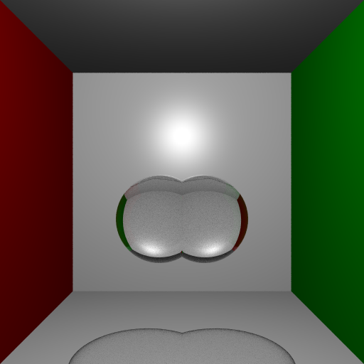
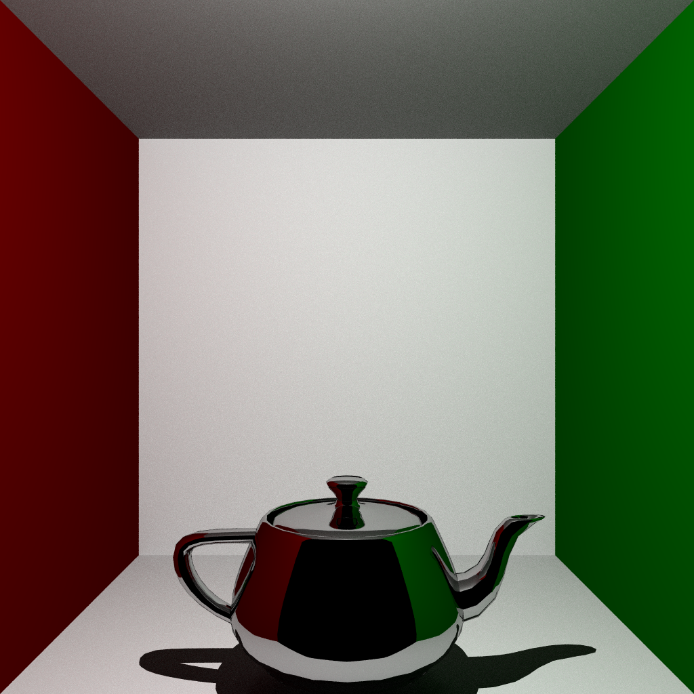
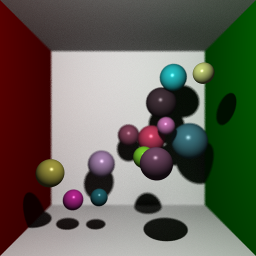

# raytracer

<p align="center">
    
    
    
<p>

## Project

This application is a ray tracer that renders a 3D scene containing different objects in various materials. The [report](report/cm30075report.pdf) contains technical details of the implementation. This software was created with the eventual goal of producing raytraced images using a photon map and including caustic effects through dielectric material. The project is not fully complete, and the photon maps are not currently used in the production of the image.

### Features

- [Dielectric](src/material/dielectric.rs), [diffuse](src/material/diffuse.rs), [metallic](src/material/metallic.rs) and [Phong shaded](src/material/phong.rs) materials
- [Direction](src/light/directional.rs) and [point](src/light/point.rs) lights
- [CSG](src/object/csg.rs), [polymesh](src/object/polymesh.rs), [quadratic](src/object/quadratic.rs), [sphere](src/object/sphere.rs) and [triangle](src/object/triangle.rs) objects
- Polymesh object creation from a file, smoothed or unsmoothed
- Parallelised image rendering
- A fully adjustable [camera](src/fullcamera.rs)

## Usage

Rust is required to run this project. You can install the Rust compiler using [Rustup](https://rustup.rs).

Run `cargo run` to build and run the project. Beware that without changes, this will generate a  very high quality image (1024 x 1024) and take a long time. 

The following command can be run to produce an image with the default 500 samples and 512 by 512 resolution:

```bash
cargo run --package raytracer --release -- -s [SCENE]
```

where `[SCENE]` can be one of the following: `cornell`, `full` or `material` to change the contents of the output. The number of samples and resolution can be changed by using `--samples` and `-r` respectively.

The output image will appear in the root directory as `test.png` and may look something like [this example](images/exampleoutput.png), which is the full scene rendered with 1000 samples and 1024 resolution.

### Cargo Features

The "unfinished" feature contains the incomplete photon mapping and caustics map, and can be activated by adding `--all-features` to the cargo command like so:

```bash
cargo run --package raytracer --release --all-features -- -s [SCENE]
```

This will not produce a realistic render and will take *significantly longer* than a normal run.